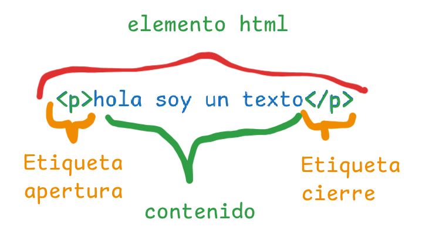

# ¿Qué es HTML?
Según sus siglas, lenguaje de marcado de texto(Hiper Text markup language).
HTML es un lenguaje que nos permite organizar nuestro contenido de manera estructural.
Nos permite darle sentido semantico al contenido que vayamos creando, eso significa que html le indicará al navrgador que tipo de cotenido debemos crear.
## ¿Qué es un elemento?
Es la manera como html le da un sentido semántico al contenido.
## Estructura de un elemento
 

- Etiqueta de apertura
- Contenido
- Etiqueta de cierre
### Etiquetas de bloque
- h1 - títulos
- h2 - subtítulo
- p - párrafo
- ul - crear listas desordenadas o con viñetas, esta etiqueta usa en su contenido el elemento de la lista.
- ol - Crear listas ordenadas o con números, al igual que la etiqueta anterior debemos usaren su contenido el elemento <li> para mostrar a cada elemento en la lista 
### Etiquetas en línea
- strong - Negrita
- i - cursiva
- sup - super-índice
- sub - sub-índice
### Etiquetas con contenido
Son los elementos que tiene apertura, contenidoy cierre.
Ejem: 
- `<h1>título</h1>` 
### Etiquetas vacíos
Son los elementos que solo tienen la etiqueta de apertura.
Ejem:
- `<hr>` o etiquetas de multimedia como ``.
### Atributos en etiquetas
Los atributos nos permiten ampliar la funcionalidad de un elemento, los atributos se especifican en las etiquetas de apertura. Su estructura es la siguiente:
- `nombre="valor"`
  
# ¿Que son las Rutas?
Las rutas son un sistema infórmatico, se refiere a la forma jerárquica de especificar la ubicación de un archivo o directorio. Las rutas son cruciales para el sistema operativo, ya que permite localizar y acceder a archivos y directorios.
Hay dos tipos de rutas:
- Ruta absoluta
- Ruta relativa 
## Ruta absoluta:
Es la ubicación de un archivo o directorio epecificada desde el directorio raíz, siempre comienza desde el inicio del disco duro u otro dispositivode almacenamiento, describiendo cada paso que el usuario debe realizar a travésdeñ sistema de archivos para llegar a la ubicación especificada.
- Fáciles de entender
- Útiles cuándo se necesita especificar con precisión la ubicación de un archivo.
`C:\Users\User\Documents\file.txtCopiar`
##  Ruta relativa:
Una ruta relativa es la ubicación de un archivo o directorio con respecto a su directorio de trabajo actual. A diferencia de una ruta absoluta, la ruta relativa no empieza con una barra ni una letra de unidad, ya que no parte del directorio raíz.
Las rutas relativas se adaptan a los cambios en el directorio de trabajo actual, lo que las hace convenientes para la creación de scripts , el desarrollo y la gestión de archivos dentro de un contexto localizado.

Este tipo de ruta también acepta puntos de entrada, lo que permite a los usuarios especificar rutas relativas para archivos más cercanos al directorio raíz .
La ..entrada representa el directorio principal.
La .entrada representa el directorio actual.
`.\document.txt`

# Unidades de medida
## Medidas Absolutas:
Son las medidas más comunes al trabajar sitios web al trabajar.Su nombre específica su funcionalidad y es que no dependen de ninguna otra unidad, simplemente es el valor de referencia que le asignemos. Estas medidas no cambián según las especificacionesdel dispositivo, lo ideal es utilizar estas medidas cuándo sabemos exactamente eñl alcance de nuestro proyecto.

- Pixeles (px):
Son la unidad de medida más conocida en ccs y un pixel no es más unos pequeños puntos luminosos en la pantalla del dispositivo, al ser una medida absoluta no cambia en lo más mínimo si lo visualizamos en dispositivos con menor resolución y esto puede dar problemas al desarrollar un sitio o aplicación web.

- POints (pt): 
Esta unidad es la más conocida por los diseñadores, lo principal es saber que esta medida nunca se recomienda para maquetar un sitio.

## Medidas Relativas:
A diferencia de las absolutas, las relativas son las que normalmente no utilizamos, estas medidas se calculan dependiendo de otra unidad de medida definida, por ejemplo ```em``` y ```rem```.
### Ems (em):
Se ha hecho muy popular para los desarrolladores web, una de las razones es que el layout se ajusta siempre al entorno. Lo que hace especial a esta medida es que cambia el tamaño de los elementos hijo dependiendo del tamaño de fuente del elemento padre.
El elemento padre tiene por defecto 10px eso hace que 1em tenga el valor de 10px, entonces:

- 1em = 10px
- 2em = 20px
- 3em = 30px
Y asi sucesivamente…

### Rems (rem): 
El rem funciona con el font-size pero no del elemento padre sino del root (la raíz) y con esto solucionamos el problema que señalaba anteriormente de tener muchos divs en nuestro contenido.

La etiqueta que representa el root de un documento es html, así que haremos lo mismo que con la medida em solo que lo definiremos dentro del elemento html, lo que necesitamos saber siempre es que por defecto los navegadores definen el font-size del documento en 16px, entonces por defecto el rem tiene un valor de 16px, principalmente los desarrolladores usamos un «truco» aprovechando el root del documento.

# ¿Cuándo usar los atributos ID y Class?
Los identificadores y las clases son atributos de HTML que se utilizan para dar estilo a elementos específicos en una página web. En CSS, se utilizan los selectores de ID y de clase para aplicar estilos a elementos HTML.
- Identificador (ID):
Un identificador (ID) es un atributo único que se le da a un solo elemento HTML en una página. Solo debe haber un elemento en la página que tenga ese ID. Los ID se definen en HTML utilizando el atributo «id», y se seleccionan en CSS utilizando el selector «#».
- Clase (Class): 
Por otro lado, una clase (Class) es un atributo que se le da a uno o más elementos HTML en una página. Se pueden aplicar varias clases a un solo elemento, y varias clases a varios elementos. Las clases se definen en HTML utilizando el atributo «class», y se seleccionan en CSS utilizando el selector «.»

## ¿Cuándo usarlo?
### ID
- Identificar un elemento específico en la página, como un encabezado principal.
- Enlazar a una sección específica de la página utilizando un ancla.
- Aplicar un estilo específico a un formulario o elemento de entrada.
  
### Class
- Aplicar un estilo específico a un grupo de elementos que tienen algo en común, como un grupo de botones de redes sociales.
- Estilizar un grupo de elementos de acuerdo con su posición en la página, como la barra lateral o el pie de página.
- Estilizar elementos que comparten características similares, como títulos de secciones. 